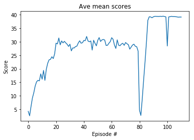

## Methodology

This work implements the DDPG algorithm (Deep Deterministic Policy Gradients) to the 20 agents Reacher environment, as described in [_Continuous Control with Deep Reinforcement Learning_][ddpg-paper] (Lillicrap et al). The foundation of this code-base is from the [Udacity DRL `ddpg-bipedal` notebook][ddpg-repo]

[ddpg-paper]: https://arxiv.org/pdf/1509.02971.pdf
[ddpg-repo]: https://github.com/udacity/deep-reinforcement-learning/blob/master/ddpg-bipedal/DDPG.ipynb

## Implementation 

The network comprises of 2 networks:

- Actor: 256 -> 256
- Critic: 256 -> 256 -> 128

Hyperparameters:

- replay buffer size = 1e6
- minibatch size = 128-1024
- discount factor = 0.99
- tau for soft update of target parameters = 1e-3
- learning rate of the actor = 1e-4
- learning rate of the critic = 3e-4
- L2 weight decay = 0.0001

with the keep alive utility, to the extent I almost threw in the course.  This made it extremely difficult to experiment with techniques and hyperparameters which is imperative with the unstable nature of RL learning.  In the end I had to do learning in batches (saving progressive results) to cater for restarting learning after a disconnection.
Finally, I have to say that the tutor assistance is close to useless with them just repeating what is in the course literature when asked for assistance.  Tutors are meant to help student understanding not treat them as an interruption.   For those struggling with the exercise, here are my take-aways:
1.	Use the class Agent object for the models and instance objects for experience and learning both speeds up learning and assists with convergence
2.	The network is sensitive to batch_size for learning and this varies throughout the process.  Early on a small batch_size is needed to set a baseline for weight to start learning and then as the model grows batch_sizes need to increase to allow the model to continue to learn.
3.	Adding of noise to actions need to be turned off towards the end of learning allowing the model operate purely on a experiential level.
4.	Due to connectivity problems I wasn’t able to fully explore optimum settings but those used produced good results.

## Results 

The agents were able to solve task solved in 211 episodes!	Average Score: 30.11.

## Enhancements

- Improving results tunning the networks scructures (adding layers or units per layers, ...)
- Implement PPO, D3PG or D4PG that probably  would produce better results

